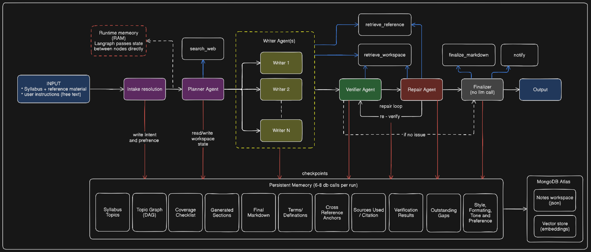

# 🐼 PandaPrep — Agentic AI Revision & Study Notes Platform

[](https://pandaprep.vercel.app/)

> **Live Application**: [https://pandaprep.vercel.app/](https://pandaprep.vercel.app/)

PandaPrep is an agentic study notes generation and interactive learning platform built for university students and educators. It transforms complex, multi-unit syllabi and reference materials into mathematically rigorous, beautifully structured revision guides with LaTeX formulas, diagrams, and self-correcting verification.

---

## 🏗️ Monorepo Architecture

PandaPrep is organized as a lightweight monorepo containing three core services:

```text
pandaprep-live/
├── frontend/             # Next.js 15 (App Router, TailwindCSS, KaTeX, Client-side PDF export)
├── backend-agentic/      # Bounded LangGraph.js Agentic Runtime in TypeScript
├── backend/              # User account management, Razorpay billing, Cloudinary storage
├── vercel.json           # Multi-service monorepo routing configuration
├── full-architecture.md  # Detailed system architecture blueprint
└── agentic-observability-evals-report.md # Observability, metrics, and evaluation engineering report
```

### Service Breakdown

| Service               | Technology                                       | Role & Key Responsibilities                                                                                                                                                          |
| --------------------- | ------------------------------------------------ | ------------------------------------------------------------------------------------------------------------------------------------------------------------------------------------ |
| **`frontend`**        | Next.js 15, React 19, TailwindCSS, KaTeX         | Responsive student portal, interactive Markdown/LaTeX viewer, real-time generation polling, client-side vector PDF generation (`window.print()`).                                    |
| **`backend-agentic`** | TypeScript, LangGraph.js, Express, MongoDB Atlas | Bounded stateful agent pipeline: **Intake** $\to$ **Planner DAG** $\to$ **Scoped Writers** $\to$ **Verifier (6 contract checks)** $\to$ **Targeted Repair Loop** $\to$ **Finalize**. |
| **`backend`**         | Node.js, Express, Mongoose, Razorpay SDK         | User authentication checks, subscription credits, payment webhooks, and PDF upload to Cloudinary.                                                                                    |

---

## 🤖 Agentic Generation Workflow (`backend-agentic`)

Unlike traditional linear automation scripts, PandaPrep executes a **bounded stateful agent graph** powered by LangGraph.js and MongoDB Atlas checkpoints:



### Resilient Multi-Provider LLM Tiering

1. **Primary**: Google Gemini (`gemini-3.5-flash-lite`)
2. **Fallback 1**: Groq (`openai/gpt-oss-20b`)
3. **Fallback 2**: OpenCode Zen (`deepseek-v4-flash-free`)
4. **Vector Embeddings**: Google Gemini (`gemini-embedding-2`, 768-dim normalized)

---

## 🚀 Getting Started (Local Development)

### Prerequisites

- Node.js v20+
- MongoDB Atlas Cluster (Free Tier M0 or higher)
- API Keys for Gemini, Firebase, and optional observability (Langfuse)

### 1. Setup Environment Variables

- **Frontend**: Create `frontend/.env.local`

  ```env
  NEXT_PUBLIC_FIREBASE_API_KEY="AIza..."
  NEXT_PUBLIC_FIREBASE_AUTH_DOMAIN="pandaprep-22edc.firebaseapp.com"
  NEXT_PUBLIC_FIREBASE_PROJECT_ID="pandaprep-22edc"
  NEXT_PUBLIC_RAZORPAY_KEY_ID="rzp_test_..."
  NEXT_PUBLIC_PROD_BASE_URL="http://localhost:8000/"
  NEXT_PUBLIC_AGENTIC_BASE_URL="http://localhost:8001/api"
  ```

- **Agentic Backend**: Create `backend-agentic/.env`

  ```env
  PORT=8001
  NODE_ENV=development
  MONGODB_URI="mongodb+srv://<user>:<pass>@cluster.mongodb.net/pandaprep"
  GEMINI_API_KEY="AIza..."
  OPENCODE_API_KEY="opencode_..."
  LANGFUSE_PUBLIC_KEY="pk-lf-..."
  LANGFUSE_SECRET_KEY="sk-lf-..."
  LANGFUSE_HOST="https://cloud.langfuse.com"
  ```

- **Legacy Backend**: Create `backend/.env`
  ```env
  PORT=8000
  MONGODB_URI="mongodb+srv://<user>:<pass>@cluster.mongodb.net/pandaprep"
  CLOUDINARY_CLOUD_NAME="..."
  CLOUDINARY_API_KEY="..."
  CLOUDINARY_API_SECRET="..."
  RAZORPAY_KEY_ID="rzp_test_..."
  RAZORPAY_KEY_SECRET="..."
  ```

### 2. Run All Services

In three separate terminal windows:

```bash
# Terminal 1: Frontend
cd frontend
npm install
npm run dev

# Terminal 2: Agentic Backend
cd backend-agentic
npm install
npm run dev

# Terminal 3: Legacy Backend
cd backend
npm install
npm run dev
```

- Frontend runs on `http://localhost:3000`
- Agentic Backend runs on `http://localhost:8001`
- Legacy Backend runs on `http://localhost:8000`

---

## 🧪 Testing & Automated Evals

Run the test harness inside `backend-agentic`:

```bash
# Run unit, contract, and integration tests (Vitest)
npm test

# Run LLM-as-a-Judge offline golden dataset evaluation benchmark
npm run test:evals
```

---

## 🚢 Deployment on Vercel

PandaPrep is configured for zero-friction Vercel deployment:

1. **Multi-Service Monorepo**: Connect your GitHub repository to Vercel and select the **Services** preset. The root [vercel.json](file:///d:/coding_d/PandaPrep/vercel.json) routes `/api/backend` to `backend`, `/api/agentic` to `backend-agentic`, and all other traffic to `frontend`.
2. **Independent Deployments**: Alternatively, import `frontend`, `backend`, and `backend-agentic` as three separate Vercel projects setting their respective Root Directories.

---

## 📄 License

ISC License. Built for students with ❤️ by Team PandaPrep.
