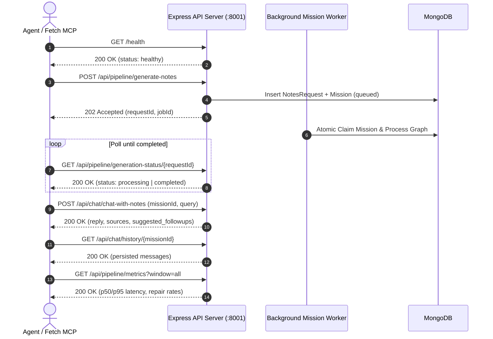

# PandaPrep Bounded Agentic Backend — API Reference & Testing Guide

> **Version**: `1.0.0`  
> **Protocol**: `HTTP/1.1` / `REST`  
> **Data Format**: `application/json`  
> **OpenAPI Specs**: [openapi.yaml](file:///d:/coding_d/PandaPrep/backend-agentic/docs/openapi.yaml) | [openapi.json](file:///d:/coding_d/PandaPrep/backend-agentic/docs/openapi.json)

---

## 1. Overview & Architecture

The PandaPrep Agentic Backend delivers autonomous, structured revision notes synthesis and multi-turn grounded Q&A through a bounded multi-agent system.

### Core Capabilities
- **Autonomous Note Synthesis**: Ingests raw syllabi, generates deterministic topic graphs (DAGs), drafts modular sections, and performs self-correcting verifier repairs.
- **Asynchronous Mission Queue**: Enqueues generation jobs with atomic worker claims, heartbeats, and stale-worker recovery.
- **Grounded Q&A Agent**: Restricts multi-turn chat responses strictly to synthesized notes workspaces with source citations and follow-up prompts.
- **Operational Observability (Pillar 2)**: Exposes real-time repair rates, checklist exhaustion rates, latency percentiles (p50/p95/p99), and active worker health metrics.

---

## 2. Server Base URLs & Environment

| Environment | Base URL | Description |
| :--- | :--- | :--- |
| **Local Development** | `http://localhost:8001` | Default port configured in `.env` (`PORT=8001`) |
| **Production** | `https://pandaprep-live.vercel.app` | Production reverse proxy / deployment |

---

## 3. Global Headers & Conventions

### Request Headers
| Header | Type | Required | Description | Example |
| :--- | :--- | :--- | :--- | :--- |
| `Authorization` | `string` | **Yes** (except `/health`) | `Bearer <firebase_id_token>` | `Bearer eyJhbGciOi...` |
| `Content-Type` | `string` | **Yes** (for POST) | Must be `application/json` | `application/json` |
| `X-Correlation-ID` | `string` | No | Distributed tracing correlation UUID. If omitted, server generates one. | `3f0b2f51-24b5-4b20-91bf-54848a60de56` |

### Response Envelopes
All responses follow a predictable JSON envelope format:

#### Success Response
```json
{
  "success": true,
  "data": "..."
}
```

#### Error Response
```json
{
  "success": false,
  "error": "User-facing error description",
  "details": {}
}
```

---

## 4. Authentication Rules

All protected endpoints enforce the `verifyFirebaseToken` middleware:
1. **Production**: Requires a valid Firebase JWT in the `Authorization: Bearer <token>` header.
2. **Development / Test (`NODE_ENV !== 'production'`)**: If Firebase Admin credentials are not initialized, **any non-empty Bearer token** (e.g. `Bearer test-token`) is accepted, assigning the caller a mock identity (`uid: 'dev-user'`, `email: 'dev@pandaprep.test'`).

---

## 5. Rate Limiting Matrix

The backend enforces sliding window rate limiting tracked via MongoDB `RateLimitModel`:

| Endpoint | Window | Limit | Target Key | HTTP Response on Breach |
| :--- | :--- | :--- | :--- | :--- |
| `POST /api/pipeline/generate-notes` | 5 minutes | 10 requests | `userId` or `ip` | `429 Too Many Requests` |
| `POST /api/chat/chat-with-notes` | 5 minutes | 30 requests | `userId` or `ip` | `429 Too Many Requests` |
| `POST /api/chat/message` | 5 minutes | 30 requests | `userId` or `ip` | `429 Too Many Requests` |
| `GET /api/pipeline/metrics` | 1 minute | 60 requests | `userId` or `ip` | `429 Too Many Requests` |
| `GET /health` | None | Unlimited | Public | N/A |

---

## 6. Detailed API Endpoint Reference

---

### `GET /health` & `GET /api/health`
**Description**: Probes service liveness, process uptime, and MongoDB connectivity.

- **Auth**: Public (None)
- **Rate Limit**: None

#### Responses
- **`200 OK`**: Database is connected and healthy.
  ```json
  {
    "status": "healthy",
    "timestamp": "2026-08-17T01:00:00.000Z",
    "database": "connected",
    "uptimeSeconds": 1420.5
  }
  ```
- **`503 Service Unavailable`**: Database is disconnected or connecting.
  ```json
  {
    "status": "degraded",
    "timestamp": "2026-08-17T01:00:00.000Z",
    "database": "disconnected",
    "uptimeSeconds": 1420.5
  }
  ```

#### Fetch MCP Invocation
```json
{
  "url": "http://localhost:8001/health",
  "method": "GET"
}
```

#### cURL Snippet
```bash
curl -X GET http://localhost:8001/health
```

---

### `POST /api/pipeline/generate-notes`
**Description**: Enqueues an asynchronous revision notes synthesis mission into MongoDB. Creates `UserRequest` and `Mission` documents and returns a tracking `requestId`.

- **Auth**: `Bearer <token>`
- **Rate Limit**: 10 requests / 5 minutes
- **Headers**:
  - `Authorization: Bearer dev-token`
  - `Content-Type: application/json`
  - `X-Correlation-ID: <optional-uuid>`

#### Request Body Schema (`application/json`)
| Field | Type | Required | Default | Allowed Values | Description |
| :--- | :--- | :--- | :--- | :--- | :--- |
| `email` | `string` | **Yes** | - | Valid Email | Recipient email address |
| `subject_name` | `string` | **Yes** | - | Min length 1 | Title of academic subject |
| `syllabus` | `string` | **Yes** | - | Min length 5 | Syllabus text / module units |
| `note_type` | `string` | No | `"detailed"` | `concise`, `detailed`, `qa` | Depth of generated notes |
| `include_examples` | `string` | No | `"no"` | `yes`, `no` | Include step-by-step examples |
| `include_images` | `string` | No | `"no"` | `yes`, `no` | Image generation toggle |
| `education_level` | `string` | No | `"intermediate"` | `beginner`, `intermediate`, `advanced` | Student target level |
| `user_instructions` | `string` | No | `""` | Any string | Custom directives for the planner agent |
| `format` | `string` | No | `"markdown"` | `markdown`, `pdf` | Output format (pdf maps to markdown) |
| `relativePathToReferenceMaterial` | `string` | No | `""` | Any string | Path to custom workspace materials |

#### Example Request Body
```json
{
  "email": "student@example.com",
  "subject_name": "Database Management Systems",
  "syllabus": "Unit 1: Relational Algebra & SQL Queries\nUnit 2: Normalization (1NF, 2NF, 3NF, BCNF)\nUnit 3: Transactions & ACID Properties",
  "note_type": "detailed",
  "include_examples": "yes",
  "include_images": "no",
  "education_level": "intermediate",
  "user_instructions": "Focus heavily on normalization anomalies and transaction isolation anomalies.",
  "format": "markdown"
}
```

#### Responses
- **`202 Accepted`**:
  ```json
  {
    "success": true,
    "message": "Notes generation queued",
    "requestId": "9b1deb4d-3b7d-4bad-9bdd-2b0d7b3dcb6d",
    "jobId": "66bf744b1c8f12a3456789ab",
    "estimatedTimeSeconds": 45
  }
  ```
- **`400 Bad Request`**:
  ```json
  {
    "success": false,
    "error": "Invalid request payload",
    "details": {
      "formErrors": [],
      "fieldErrors": {
        "email": ["Invalid email"],
        "syllabus": ["Syllabus must be at least 5 characters"]
      }
    }
  }
  ```
- **`401 Unauthorized`**:
  ```json
  {
    "success": false,
    "error": "Unauthorized: No authorization token provided"
  }
  ```
- **`429 Too Many Requests`**:
  ```json
  {
    "success": false,
    "error": "Too Many Requests",
    "message": "Rate limit of 10 requests per 5 minutes exceeded. Please retry later."
  }
  ```

#### Fetch MCP Invocation
```json
{
  "url": "http://localhost:8001/api/pipeline/generate-notes",
  "method": "POST",
  "headers": {
    "Authorization": "Bearer dev-token",
    "Content-Type": "application/json"
  },
  "body": {
    "email": "student@example.com",
    "subject_name": "Operating Systems",
    "syllabus": "Unit 1: Process Management\nUnit 2: Concurrency & Semaphores\nUnit 3: Memory Management & Paging",
    "note_type": "detailed",
    "include_examples": "yes",
    "education_level": "intermediate",
    "user_instructions": "Include semaphore pseudo-code examples."
  }
}
```

#### cURL Snippet
```bash
curl -X POST http://localhost:8001/api/pipeline/generate-notes \
  -H "Authorization: Bearer dev-token" \
  -H "Content-Type: application/json" \
  -d '{
    "email": "student@example.com",
    "subject_name": "Operating Systems",
    "syllabus": "Unit 1: Process Management\nUnit 2: Concurrency & Semaphores\nUnit 3: Memory Management",
    "note_type": "detailed",
    "include_examples": "yes"
  }'
```

---

### `GET /api/pipeline/generation-status/:requestId`
**Description**: Polls the execution lifecycle status of an asynchronous generation request. Returns generated markdown content once the background worker finishes.

- **Auth**: `Bearer <token>`
- **Path Parameters**:
  - `requestId` (`string`, required): UUID assigned by `generate-notes`.
- **Headers**:
  - `Authorization: Bearer dev-token`

#### Responses
- **`200 OK (Status: Processing)`**:
  ```json
  {
    "success": true,
    "status": "processing",
    "error": null,
    "markdown": null,
    "processingTimeMs": null
  }
  ```
- **`200 OK (Status: Completed)`**:
  ```json
  {
    "success": true,
    "status": "completed",
    "error": null,
    "markdown": "# Operating Systems Revision Notes\n\n## Section 1: Process Management\n...",
    "downloadUrl": null,
    "processingTimeMs": 31250
  }
  ```
- **`200 OK (Status: Failed)`**:
  ```json
  {
    "success": true,
    "status": "failed",
    "error": "Upstream LLM provider rate limit exceeded",
    "markdown": null,
    "processingTimeMs": 15200
  }
  ```
- **`404 Not Found`**:
  ```json
  {
    "success": false,
    "error": "Notes request not found"
  }
  ```

#### Fetch MCP Invocation
```json
{
  "url": "http://localhost:8001/api/pipeline/generation-status/9b1deb4d-3b7d-4bad-9bdd-2b0d7b3dcb6d",
  "method": "GET",
  "headers": {
    "Authorization": "Bearer dev-token"
  }
}
```

#### cURL Snippet
```bash
curl -X GET http://localhost:8001/api/pipeline/generation-status/9b1deb4d-3b7d-4bad-9bdd-2b0d7b3dcb6d \
  -H "Authorization: Bearer dev-token"
```

---

### `GET /api/pipeline/metrics`
**Description**: Aggregates and returns production-grade operational observability metrics across workspace executions, self-repair loops, checklist coverage, and latency percentiles.

- **Auth**: `Bearer <token>`
- **Rate Limit**: 60 requests / 1 minute
- **Query Parameters**:
  - `window` (`string`, optional, default: `"all"`): Filter by timeframe (`1h`, `24h`, `7d`, `30d`, `all`).

#### Responses
- **`200 OK`**:
  ```json
  {
    "success": true,
    "timestamp": "2026-08-17T01:00:00.000Z",
    "window": "24h",
    "metrics": {
      "section_repair_rate_percent": 6.25,
      "checklist_exhaustion_rate_percent": 0.0,
      "average_dag_nodes": 10.4,
      "latency": {
        "p50_latency_ms": 21500,
        "p95_latency_ms": 38400,
        "p99_latency_ms": 41200
      },
      "active_worker_count": 2,
      "sample_sizes": {
        "total_workspaces": 16,
        "total_drafted_sections": 160,
        "repaired_sections": 10,
        "completed_requests": 16
      },
      "targets": {
        "section_repair_rate_percent": "< 15%",
        "checklist_exhaustion_rate_percent": "< 3%",
        "average_dag_nodes": "8 to 14",
        "p95_latency_ms": "< 45000"
      },
      "status": "healthy"
    }
  }
  ```
- **`400 Bad Request`**:
  ```json
  {
    "success": false,
    "error": "Invalid query parameters",
    "details": {
      "fieldErrors": {
        "window": ["Invalid enum value. Expected '1h' | '24h' | '7d' | '30d' | 'all'"]
      }
    }
  }
  ```

#### Fetch MCP Invocation
```json
{
  "url": "http://localhost:8001/api/pipeline/metrics?window=24h",
  "method": "GET",
  "headers": {
    "Authorization": "Bearer dev-token"
  }
}
```

#### cURL Snippet
```bash
curl -X GET "http://localhost:8001/api/pipeline/metrics?window=24h" \
  -H "Authorization: Bearer dev-token"
```

---

### `POST /api/chat/chat-with-notes` (Alias: `POST /api/chat/message`)
**Description**: Interacts with the Q&A Agent grounded against the synthesized notes workspace. Automatically appends dialogue turns to multi-turn `ChatHistoryModel`.

- **Auth**: `Bearer <token>`
- **Rate Limit**: 30 requests / 5 minutes
- **Headers**:
  - `Authorization: Bearer dev-token`
  - `Content-Type: application/json`

#### Request Body Schema (`application/json`)
| Field | Type | Required | Constraints | Description |
| :--- | :--- | :--- | :--- | :--- |
| `missionId` | `string` | Either `missionId` or `requestId` | 1 - 200 chars | Mission or Request ID of notes |
| `requestId` | `string` | Either `missionId` or `requestId` | 1 - 200 chars | Alias for `missionId` |
| `query` | `string` | Either `query` or `message` | 1 - 8000 chars | Student's question |
| `message` | `string` | Either `query` or `message` | 1 - 8000 chars | Alias for `query` |

#### Example Request Body
```json
{
  "missionId": "9b1deb4d-3b7d-4bad-9bdd-2b0d7b3dcb6d",
  "query": "What is the difference between a mutex and a counting semaphore in operating systems?"
}
```

#### Responses
- **`200 OK`**:
  ```json
  {
    "success": true,
    "reply": "A **mutex** is a locking mechanism that allows only one thread at a time to access a critical section. A **counting semaphore** maintains an integer counter allowing up to N concurrent threads.",
    "response": "A **mutex** is a locking mechanism that allows only one thread at a time to access a critical section. A **counting semaphore** maintains an integer counter allowing up to N concurrent threads.",
    "sources": [
      "Section 2: Concurrency & Semaphores"
    ],
    "suggested_followups": [
      "Can a binary semaphore be used interchangeably with a mutex?",
      "How do semaphores prevent race conditions?"
    ]
  }
  ```
- **`400 Bad Request`**:
  ```json
  {
    "success": false,
    "error": "Invalid request payload",
    "details": {
      "formErrors": ["Either missionId or requestId is required"]
    }
  }
  ```
- **`404 Not Found`**:
  ```json
  {
    "success": false,
    "error": "Revision notes not found for the specified ID"
  }
  ```
- **`429 Too Many Requests`**:
  ```json
  {
    "success": false,
    "error": "Too Many Requests",
    "message": "Rate limit of 30 requests per 5 minutes exceeded. Please retry later."
  }
  ```

#### Fetch MCP Invocation
```json
{
  "url": "http://localhost:8001/api/chat/chat-with-notes",
  "method": "POST",
  "headers": {
    "Authorization": "Bearer dev-token",
    "Content-Type": "application/json"
  },
  "body": {
    "missionId": "9b1deb4d-3b7d-4bad-9bdd-2b0d7b3dcb6d",
    "query": "Explain how semaphores work."
  }
}
```

#### cURL Snippet
```bash
curl -X POST http://localhost:8001/api/chat/chat-with-notes \
  -H "Authorization: Bearer dev-token" \
  -H "Content-Type: application/json" \
  -d '{
    "missionId": "9b1deb4d-3b7d-4bad-9bdd-2b0d7b3dcb6d",
    "query": "Explain how semaphores work."
  }'
```

---

### `GET /api/chat/history/:missionId`
**Description**: Fetches paginated multi-turn chat messages between user and assistant for the specified workspace.

- **Auth**: `Bearer <token>`
- **Path Parameters**:
  - `missionId` (`string`, required): Mission ID or Request ID
- **Query Parameters**:
  - `limit` (`integer`, optional, default: `100`, max: `200`): Message count limit
  - `offset` (`integer`, optional, default: `0`): Message offset skip

#### Responses
- **`200 OK`**:
  ```json
  {
    "success": true,
    "mission_id": "9b1deb4d-3b7d-4bad-9bdd-2b0d7b3dcb6d",
    "messages": [
      {
        "role": "user",
        "content": "Explain how semaphores work.",
        "timestamp": "2026-08-17T01:05:00.000Z"
      },
      {
        "role": "assistant",
        "content": "A semaphore is a synchronization primitive...",
        "sources": [
          { "section": "Section 2: Concurrency & Semaphores" }
        ],
        "timestamp": "2026-08-17T01:05:03.000Z"
      }
    ]
  }
  ```

#### Fetch MCP Invocation
```json
{
  "url": "http://localhost:8001/api/chat/history/9b1deb4d-3b7d-4bad-9bdd-2b0d7b3dcb6d?limit=50&offset=0",
  "method": "GET",
  "headers": {
    "Authorization": "Bearer dev-token"
  }
}
```

#### cURL Snippet
```bash
curl -X GET "http://localhost:8001/api/chat/history/9b1deb4d-3b7d-4bad-9bdd-2b0d7b3dcb6d?limit=50" \
  -H "Authorization: Bearer dev-token"
```

---

## 7. Automated End-to-End Testing Workflow for Fetch MCP

When testing the backend agentic pipeline using the Fetch MCP tool, execute tests following this 6-step lifecycle:



### Step 1: Healthcheck Probing
Call `GET /health` to ensure the server and MongoDB connection are online.
```json
{
  "url": "http://localhost:8001/health",
  "method": "GET"
}
```
*Expected: Status code 200 and `"database": "connected"`.*

---

### Step 2: Enqueue Notes Generation
Call `POST /api/pipeline/generate-notes` with valid payload and save the `requestId`.
```json
{
  "url": "http://localhost:8001/api/pipeline/generate-notes",
  "method": "POST",
  "headers": {
    "Authorization": "Bearer dev-token",
    "Content-Type": "application/json"
  },
  "body": {
    "email": "tester@pandaprep.test",
    "subject_name": "Computer Networks",
    "syllabus": "Unit 1: OSI vs TCP/IP Models\nUnit 2: Sliding Window Protocols (Go-Back-N, Selective Repeat)\nUnit 3: Routing Algorithms (Dijkstra, Bellman-Ford)",
    "note_type": "detailed",
    "include_examples": "yes",
    "education_level": "intermediate"
  }
}
```
*Expected: Status code 202, capturing `"requestId"` and `"jobId"`.*

---

### Step 3: Polling Generation Status
Poll `GET /api/pipeline/generation-status/{requestId}` with 3–5 second intervals until `status === "completed"`.
```json
{
  "url": "http://localhost:8001/api/pipeline/generation-status/<REPLACE_WITH_REQUEST_ID>",
  "method": "GET",
  "headers": {
    "Authorization": "Bearer dev-token"
  }
}
```
*Expected: Status transitions from `"processing"` -> `"completed"` with non-null `"markdown"`.*

---

### Step 4: Multi-Turn Grounded Chat
Ask a contextual syllabus question using `POST /api/chat/chat-with-notes`.
```json
{
  "url": "http://localhost:8001/api/chat/chat-with-notes",
  "method": "POST",
  "headers": {
    "Authorization": "Bearer dev-token",
    "Content-Type": "application/json"
  },
  "body": {
    "missionId": "<REPLACE_WITH_REQUEST_ID>",
    "query": "How does Selective Repeat protocol differ from Go-Back-N?"
  }
}
```
*Expected: Status code 200 with grounded `"reply"`, `"sources"`, and `"suggested_followups"`.*

---

### Step 5: Verify Chat History
Inspect persisted history via `GET /api/chat/history/{missionId}`.
```json
{
  "url": "http://localhost:8001/api/chat/history/<REPLACE_WITH_REQUEST_ID>?limit=10",
  "method": "GET",
  "headers": {
    "Authorization": "Bearer dev-token"
  }
}
```
*Expected: Status code 200 with an array containing the user question and assistant reply.*

---

### Step 6: Query Pipeline Observability Metrics
Inspect aggregated benchmarks via `GET /api/pipeline/metrics?window=all`.
```json
{
  "url": "http://localhost:8001/api/pipeline/metrics?window=all",
  "method": "GET",
  "headers": {
    "Authorization": "Bearer dev-token"
  }
}
```
*Expected: Status code 200, containing `repair_rate_percent`, `latency` percentiles, and `status: "healthy"`.*

---

### Step 7: Negative / Error Case Testing
Execute negative assertions to verify robust error boundaries:
1. **Invalid Email / Short Syllabus**: `POST /api/pipeline/generate-notes` with `{ "email": "bad", "syllabus": "abc" }` -> **400 Bad Request**.
2. **Missing Token**: `GET /api/pipeline/metrics` with no Authorization header -> **401 Unauthorized**.
3. **Non-Existent Mission**: `POST /api/chat/chat-with-notes` with `{ "missionId": "00000000-0000-0000-0000-000000000000", "query": "hi" }` -> **404 Not Found**.
4. **Rate Limit Trigger**: Fire 12 consecutive requests to `POST /api/pipeline/generate-notes` -> **429 Too Many Requests**.

---

## 8. HTTP Status Codes & Error Envelopes Reference

| HTTP Status Code | Meaning | Common Cause in PandaPrep Backend |
| :--- | :--- | :--- |
| **`200 OK`** | Success | Request processed synchronously (status check, metrics, chat reply). |
| **`202 Accepted`** | Asynchronously Queued | Generation mission accepted and queued for worker execution. |
| **`400 Bad Request`** | Validation Error | Request body or query parameters failed Zod schema checks. |
| **`401 Unauthorized`** | Authentication Failure | Missing or invalid Firebase Bearer token. |
| **`404 Not Found`** | Resource Not Found | Target `requestId` or `missionId` does not exist or belongs to another user. |
| **`429 Too Many Requests`** | Rate Limit Exceeded | Client exceeded sliding window limit for the targeted route. |
| **`500 Internal Server Error`** | Server Error | Unhandled server error (correlation ID logged, details hidden from client). |
| **`503 Service Unavailable`** | Upstream Unavailable | MongoDB connection disconnected or Firebase Admin unavailable in prod. |
